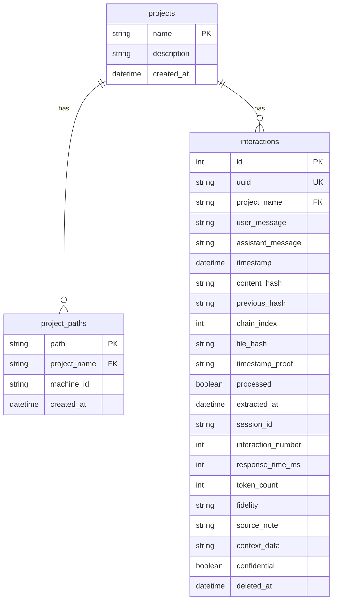
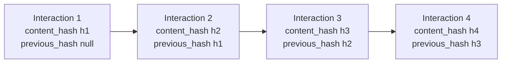
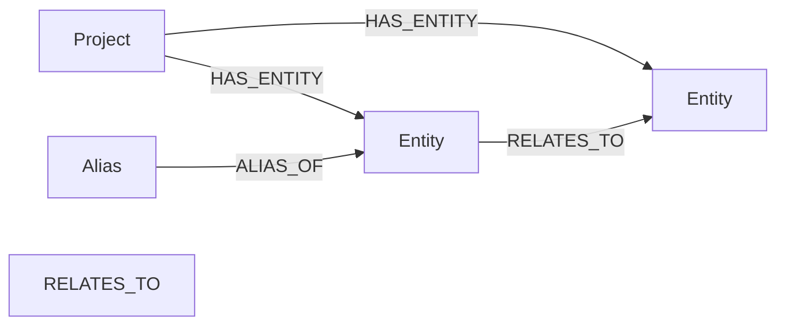
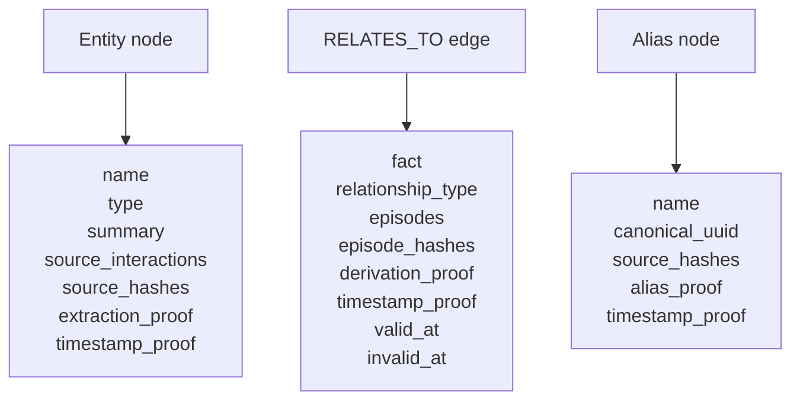
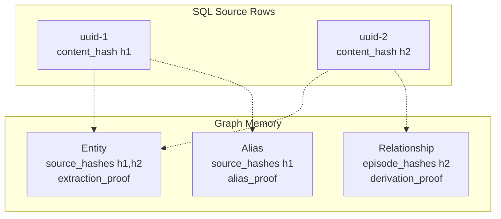
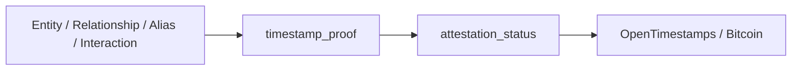
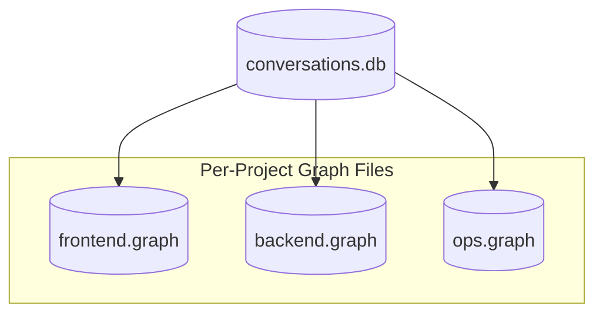

# Database Schema Diagrams

Compact schema diagrams for the SQL audit log and graph memory layers.

Current model:
- SQL database: `conversations.db`
- graph database: `{project}.graph`

---

## 1. SQL Audit Log Schema



**Primary role:**
- append-only conversation audit log
- integrity proof via `content_hash`, `previous_hash`, `chain_index`

---

## 2. Integrity Chain



**Integrity proof checks:**
- recompute `content_hash`
- verify `previous_hash`
- verify sequential `chain_index`

---

## 3. Graph Memory Schema





**Primary role:**
- queryable memory for entities, facts, relationships, and aliases

---

## 4. Derivation Links



**Interpretation:**
- graph artifacts carry source hashes so they can be checked later
- this is the derivation layer, not the integrity layer

---

## 5. Timestamp and Attestation Fields



**Terminology:**
- `timestamp_proof` = local timestamp claim
- `attestation_status` = whether external anchoring was attempted or confirmed

---

## 6. SQL vs Graph Responsibility Split

```mermaid
flowchart LR
    SQL[(conversations.db<br/>raw interactions<br/>integrity proof)]
    Graph[({project}.graph<br/>entities, facts, aliases<br/>derivation proofs)]

    SQL -.source hashes feed.-> Graph
```

**Use SQL for:**
- conversation export
- chain verification
- provenance recovery

**Use Graph for:**
- memory queries
- relationship traversal
- semantic recall

---

## 7. Multi-Project Layout



**Model:**
- one shared SQL audit log
- one graph memory file per project by default

---

## See Also

- [system-architecture.md](./system-architecture.md)
- [../data-model.md](../data-model.md)
- [../../docs/database-schema.md](../../docs/database-schema.md)
- [../../docs/proof-model.md](../../docs/proof-model.md)
