# System Architecture Diagram

Primary architecture diagrams for the LLM Memory System.

These diagrams reflect the current runtime model:
- SQL audit log: `conversations.db`
- Graph memory: `{project}.graph`
- dual path contexts:
  - subsystem repo mode: `./memory`, `./tmp`
  - host workspace mode: `./mem/memory`, `./mem/tmp`

See [../../docs/proof-model.md](../../docs/proof-model.md) for canonical proof
terminology.

---

## 1. High-Level Architecture

```mermaid
flowchart TB
    User[User or LLM Agent]

    subgraph Interface[Workflow Interface]
        Sync[sync.md]
        Remember[remember.md]
        Search[search.md]
        Verify[verify.md]
        Export[export.md]
    end

    subgraph Scripts[Execution Layer]
        Import[import_conversation.py]
        Store[store_extraction.py]
        Query[query_memory.py]
        Check[verify_integrity.py]
        History[export_history.py]
    end

    subgraph Logic[Core Logic]
        Config[config.py]
        SQLLib[sql_db.py]
        GraphLib[graph_db.py]
        Review[deduplication.py / contradiction.py]
    end

    subgraph Storage[Storage]
        SQL[(SQL Audit Log<br/>conversations.db)]
        Graph[(Graph Memory<br/>{project}.graph)]
    end

    User --> Interface --> Scripts --> Logic
    Config -.paths and defaults.-> Scripts
    SQLLib --> SQL
    GraphLib --> Graph
    Review --> Graph
    Import --> SQL
    Store --> Graph
    Query --> Graph
    Check --> SQL
    Check --> Graph
    History --> SQL
    SQL -.source hashes feed.-> Graph
```

---

## 2. Path Contexts

```mermaid
flowchart LR
    subgraph Repo[Subsystem Repo Mode]
        R1[tmp files<br/>./tmp]
        R2[SQL<br/>./memory/conversations.db]
        R3[Graph<br/>./memory/{project}.graph]
        R4[Workflow file<br/>sync.md]
    end

    subgraph Host[Host Workspace Mode]
        H1[tmp files<br/>./mem/tmp]
        H2[SQL<br/>./mem/memory/conversations.db]
        H3[Graph<br/>./mem/memory/{project}.graph]
        H4[Workflow file<br/>mem/sync.md]
    end
```

**Interpretation:**
- both contexts are valid
- the difference is embedding location, not system behavior

---

## 3. Sync Workflow

```mermaid
flowchart TB
    A[Conversation recalled by agent]
    B[tmp/conversation.json]
    C[import_conversation.py]
    D[(conversations.db)]
    E[tmp/extraction.json]
    F[store_extraction.py]
    G[quality review]
    H[aliases / invalidations]
    I[({project}.graph)]

    A --> B --> C --> D
    D --> E --> F --> G --> H --> I
```

**Read it as:**
- SQL stores the conversation trail first
- graph memory is built from extraction output
- quality review refines graph state before it becomes queryable memory

---

## 4. Query Workflow

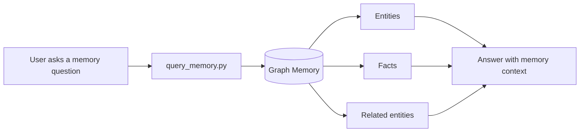

---

## 5. Trust and Verification

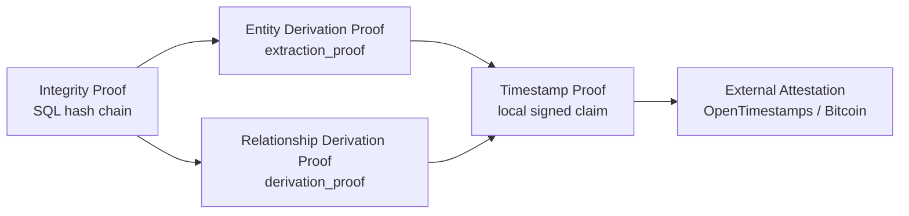

**Meaning:**
- integrity proof checks append-only interaction history
- derivation proofs check graph artifacts against source hashes
- timestamp proofs are local timestamp claims
- external attestation is a separate upgrade, not a synonym for verification

---

## 6. Shared Multi-Project Layout

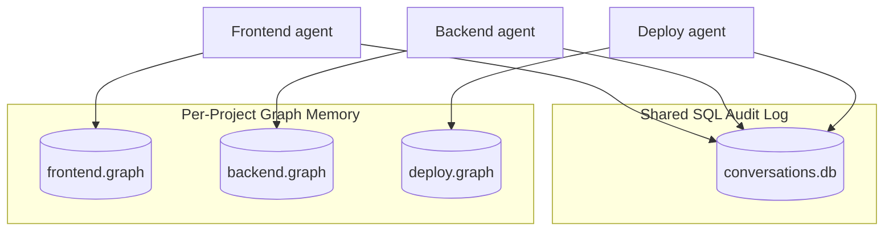

**Why this matters:**
- one SQL database can hold many projects
- graph memory stays isolated per project unless intentionally shared

---

## 7. Configuration Surface

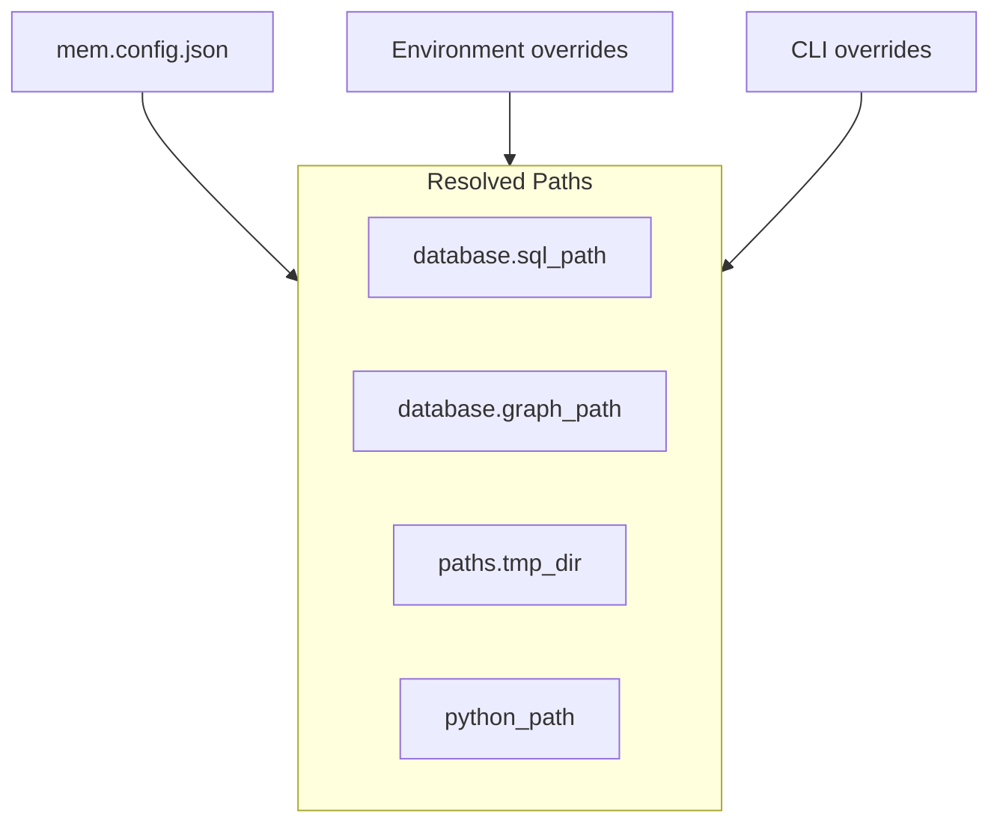

**Resolution order:**
1. defaults
2. global config
3. project config
4. environment variables
5. CLI arguments

---

## 8. Command Surface

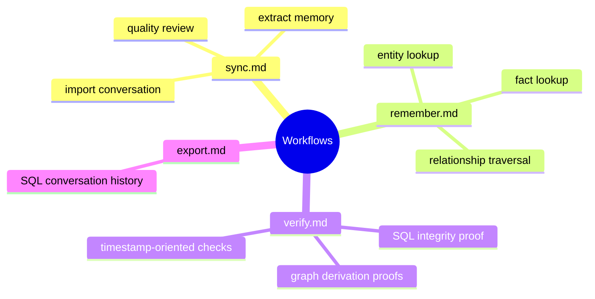

---

## 9. Integrity Chain

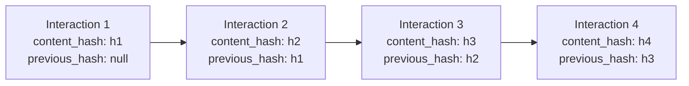

**What it proves:**
- interactions were not silently edited
- interactions were not reordered
- middle deletions break verification

---

## 10. Derivation Links

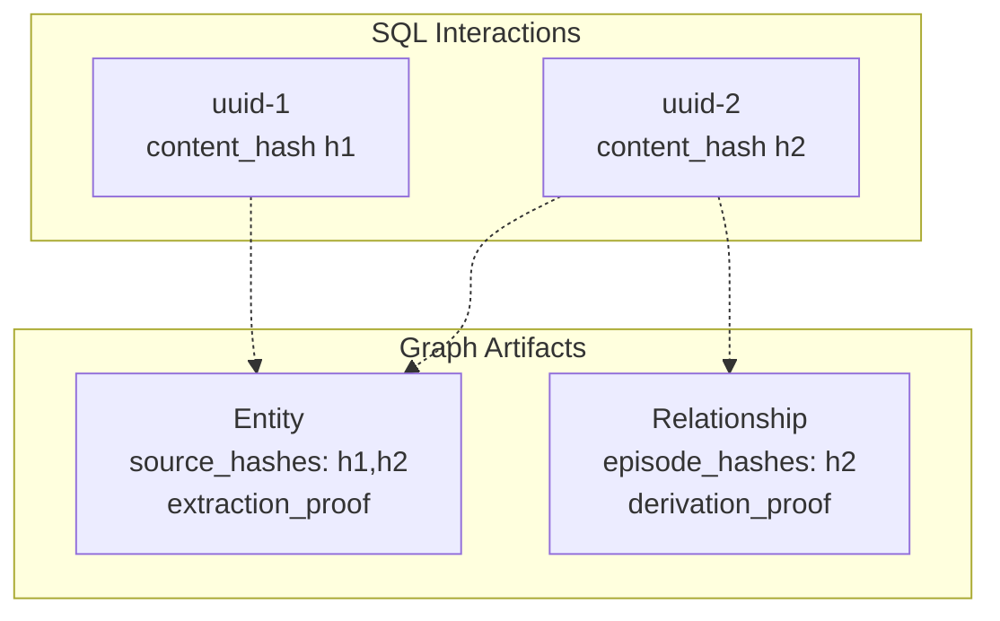

**Read it as:**
- entities and facts do not just "exist"
- they carry source hashes that can be checked later

---

## 11. Timestamp Proof States

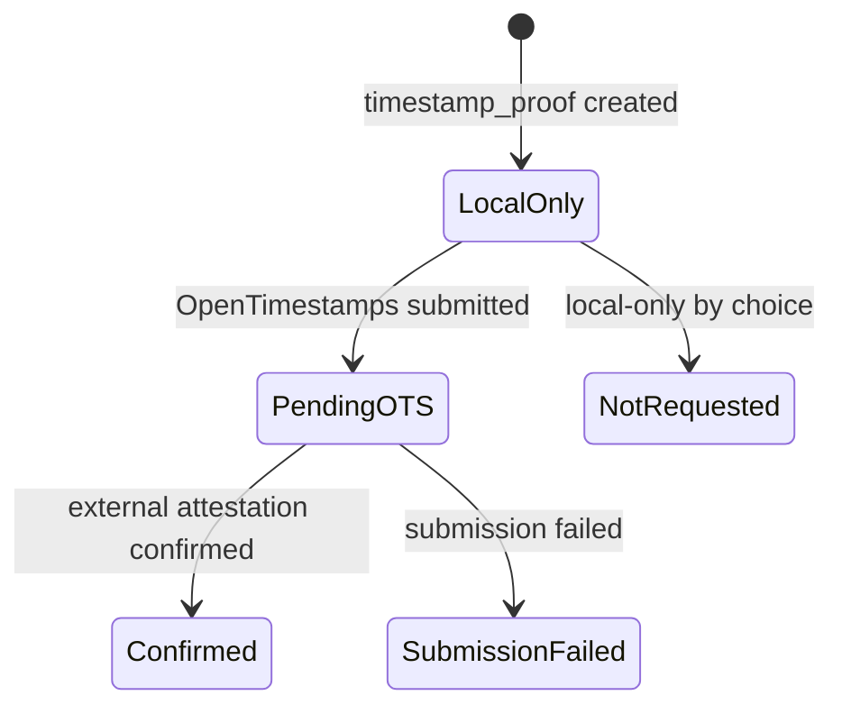

**Interpretation:**
- `timestamp_proof` exists in all cases above.
- Only `Confirmed` means external attestation is available.
- `LocalOnly` and `NotRequested` are still valid local timestamp proofs.

---

## 12. Quality Review Flow

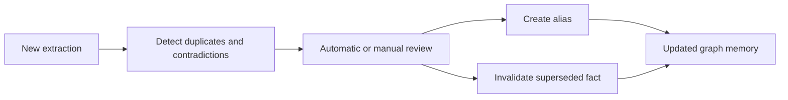

**Goal:**
- preserve history
- reduce duplicate entities
- mark stale facts without destructive deletion

---

## 13. Temporal Memory

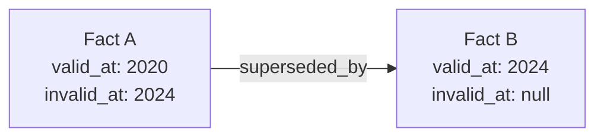

**Use it for:**
- "what was true then?"
- "what is true now?"
- "how did this belief change?"

---

## 14. Non-Destructive Deduplication

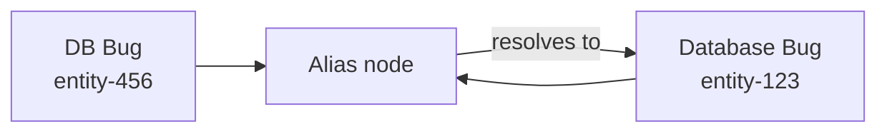

**Why aliases matter:**
- old names still work
- facts keep their lineage
- no silent data loss

---

## 15. Verification Surface

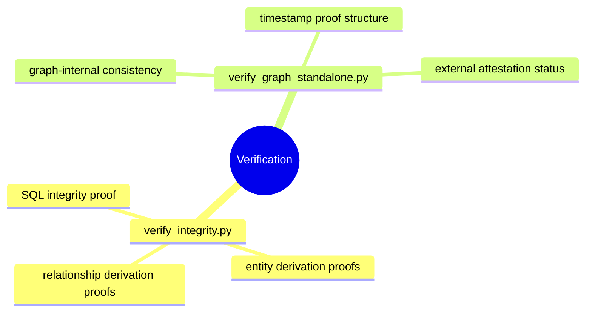

---

## Diagram Notes

- Use "integrity proof" for the SQL hash chain.
- Use "derivation proof" for `extraction_proof` and `derivation_proof`.
- Use "timestamp proof" for the local signed timestamp payload.
- Use "external attestation" for OpenTimestamps / Bitcoin anchoring.

---

## See Also

- [../database-schema.md](../database-schema.md)
- [../system-overview.md](../system-overview.md)
- [../../docs/proof-model.md](../../docs/proof-model.md)
