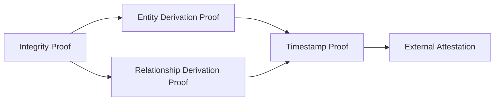
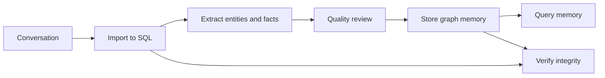

# System Overview

High-level architecture of the LLM Memory System.

Current runtime model:
- SQL audit log: `conversations.db`
- graph memory: `{project}.graph`
- graph is the memory
- SQL is the audit and provenance layer

---

## What This System Is

The LLM Memory System gives an agent durable memory across long conversations.

It does this with two storage layers:
- **SQL audit log** for raw interactions, integrity checks, and provenance
- **graph memory** for entities, facts, aliases, and temporal relationships

The system is designed so the graph can answer memory questions directly, while
SQL preserves where that memory came from.

---

## Core Architecture

```mermaid
flowchart TB
    User[User or LLM Agent]

    subgraph Interface[Workflow Files]
        Sync[sync.md]
        Remember[remember.md]
        Search[search.md]
        Verify[verify.md]
        Export[export.md]
    end

    subgraph Execution[Scripts]
        Import[import_conversation.py]
        Store[store_extraction.py]
        Query[query_memory.py]
        Check[verify_integrity.py]
        History[export_history.py]
    end

    subgraph Logic[Core Libraries]
        Config[config.py]
        SQLLib[sql_db.py]
        GraphLib[graph_db.py]
        Quality[deduplication.py / contradiction.py]
    end

    subgraph Storage[Storage]
        SQL[(conversations.db)]
        Graph[({project}.graph)]
    end

    User --> Interface --> Execution --> Logic
    Config -.resolved paths.-> Execution
    Import --> SQL
    History --> SQL
    Store --> Graph
    Query --> Graph
    Check --> SQL
    Check --> Graph
    Quality --> Graph
    SQL -.source hashes feed.-> Graph
```

---

## Path Contexts

The docs support two valid filesystem contexts.

### Subsystem Repo Mode

Use this when you are inside the memory repo itself.

- tmp files: `./tmp`
- SQL: `./memory/conversations.db`
- graph: `./memory/{project}.graph`
- workflow files: `sync.md`, `remember.md`

### Host Workspace Mode

Use this when the memory system is embedded under `./mem` inside another repo.

- tmp files: `./mem/tmp`
- SQL: `./mem/memory/conversations.db`
- graph: `./mem/memory/{project}.graph`
- workflow files: `mem/sync.md`, `mem/remember.md`

Same system, different embedding location.

---

## Responsibility Split

### SQL Audit Log

Purpose:
- store raw conversations
- preserve append-only history
- provide integrity proof via hash chain
- provide source material for provenance checks

Use SQL for:
- exporting conversation history
- verifying interaction integrity
- recovering source interactions

### Graph Memory

Purpose:
- store entities, facts, aliases, and temporal state
- answer memory questions directly
- support traversal and semantic recall
- carry derivation proofs and timestamp fields

Use graph for:
- `query_memory.py`
- relationship traversal
- factual recall
- temporal memory queries

---

## Trust Model

See [../docs/proof-model.md](../docs/proof-model.md) for the canonical terms.



Interpretation:
- **integrity proof** checks SQL history
- **derivation proof** checks graph artifacts against source hashes
- **timestamp proof** is a local signed timestamp claim
- **external attestation** is OpenTimestamps / Bitcoin anchoring state

---

## End-to-End Flow



---

## Multi-Project Model

By default:
- one shared SQL database for all projects
- one graph file per project

Example:

```text
memory/
  conversations.db
  frontend.graph
  backend.graph
  deploy.graph
```

This keeps provenance centralized while keeping graph memory isolated per
project.

---

## Why This Shape Works

- SQL is good at append-only audit history.
- Graph is good at connected memory and traversal.
- separating them keeps the graph cleaner and more queryable
- provenance remains available without forcing raw conversation text into the graph

---

## Data Flow

### Sync

```text
conversation
  -> tmp/conversation_YYYY-MM-DD_HH-MM-SS.json  (timestamped)
  -> SQL import (with --agent flag)
  -> tmp/extraction_YYYY-MM-DD_HH-MM-SS.json    (timestamped)
  -> quality review
  -> graph store (creates ExtractionBatch)
  -> queryable memory
```

### Query

```text
memory question
  -> query_memory.py
  -> graph memory
  -> entities / facts / related entities
```

### Verify

```text
verify request
  -> verify_integrity.py
  -> SQL integrity proof
  -> graph derivation proofs
```

---

## Data Model Summary

### SQL Layer

Main tables:
- `projects`
- `project_paths`
- `interactions`

Key interaction fields:
- `content_hash`
- `previous_hash`
- `chain_index`
- `timestamp_proof`
- `processed`

### Graph Layer

Main artifacts:
- `Project`
- `Entity`
- `Alias`
- `RELATES_TO`

Key graph proof fields:
- `extraction_proof`
- `derivation_proof`
- `alias_proof`
- `timestamp_proof`

Key temporal fields:
- `valid_at`
- `invalid_at`
- `superseded_by`

---

## Temporal Memory

Facts are not destructively replaced.

When a newer fact supersedes an older one:
- old fact remains in history
- old fact gets `invalid_at`
- new fact becomes current
- lineage is preserved via `superseded_by`

This supports:
- "what was true then?"
- "what is true now?"
- "what changed?"

---

## Quality Review

The graph memory is refined through:
- duplicate detection
- contradiction detection
- alias creation
- stale fact invalidation

This means graph state is curated without deleting lineage.

---

## Design Principles

- keep raw conversations out of the graph
- keep provenance recoverable
- make graph memory directly queryable
- preserve history instead of deleting it
- keep path handling explicit and configurable

---

## See Also

- [database-schema.md](./database-schema.md)
- [workflow-sync.md](./workflow-sync.md)
- [diagrams/system-architecture.md](./diagrams/system-architecture.md)
- [../docs/CONFIGURATION.md](../docs/CONFIGURATION.md)
- [../docs/proof-model.md](../docs/proof-model.md)
