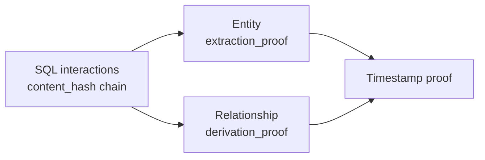

# Workflow: Sync Conversation to Memory

Architecture-level view of the sync workflow.

This document focuses on the system flow, not the full operator instructions.
For the agent-facing workflow, see [../sync.md](../sync.md) and
[../docs/MEMORY-SYSTEM-INSTRUCTIONS.md](../docs/MEMORY-SYSTEM-INSTRUCTIONS.md).

---

## Purpose

The sync workflow does two things:

1. imports raw conversation into the SQL audit log
2. turns that conversation into graph memory

---

## End-to-End Flow

```mermaid
flowchart TB
    A[Conversation recalled by agent]
    B[tmp/conversation.json]
    C[import_conversation.py]
    D[(conversations.db)]
    E[tmp/extraction.json]
    F[store_extraction.py]
    G[Quality review]
    H[Aliases / invalidations]
    I[({project}.graph)]
    J[query_memory.py]

    A --> B --> C --> D
    D --> E --> F --> G --> H --> I --> J
```

---

## Step Breakdown

### 1. Conversation Capture

The agent writes `conversation.json` from its own memory of the exchange.

Output:
- `tmp/conversation.json`

### 2. SQL Import

`import_conversation.py`:
- stores interactions in `conversations.db`
- assigns UUIDs
- computes `content_hash`
- links `previous_hash`
- advances `chain_index`

Output:
- SQL interaction rows
- a valid integrity chain

### 3. Extraction

The agent creates `extraction.json` using the imported interaction UUIDs.

Output:
- `tmp/extraction.json`

### 4. Quality Review

`store_extraction.py` runs duplicate and contradiction review.

Outcomes:
- create aliases for duplicates
- invalidate superseded facts
- preserve lineage instead of deleting history

### 5. Graph Store

`store_extraction.py` writes graph memory:
- entities
- relationships
- aliases
- derivation proofs
- timestamp fields

### 6. Query and Verify

After sync:
- `query_memory.py` reads the graph memory
- `verify_integrity.py` checks SQL integrity proof and graph derivation proofs

---

## Proof Flow



Interpretation:
- SQL integrity proof comes first
- graph artifacts depend on SQL source hashes
- timestamp proofs are separate from integrity and derivation checks

---

## Working Files

### Subsystem Repo Mode

- `./tmp/conversation.json`
- `./tmp/extraction.json`
- `./memory/conversations.db`
- `./memory/{project}.graph`

### Host Workspace Mode

- `./mem/tmp/conversation.json`
- `./mem/tmp/extraction.json`
- `./mem/memory/conversations.db`
- `./mem/memory/{project}.graph`

---

## Why the Workflow Is Split

The workflow intentionally separates:
- conversation import
- semantic extraction
- quality review
- graph storage

That separation makes it easier to:
- preserve provenance
- recover from extraction mistakes
- rebuild graph memory from the SQL audit log

---

## Success Conditions

A sync is successful when:
- interactions are present in SQL
- integrity chain verifies
- entities and facts are queryable in graph memory
- duplicate and contradiction handling has been applied

---

## See Also

- [system-overview.md](./system-overview.md)
- [data-model.md](./data-model.md)
- [diagrams/system-architecture.md](./diagrams/system-architecture.md)
- [../sync.md](../sync.md)
