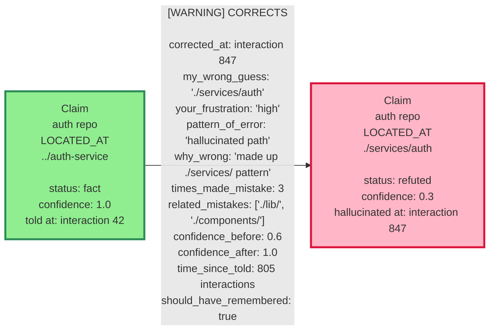
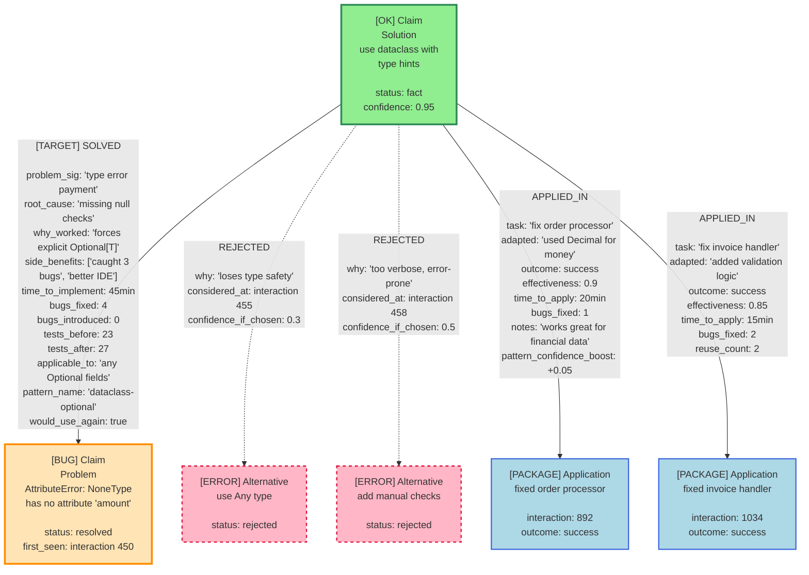
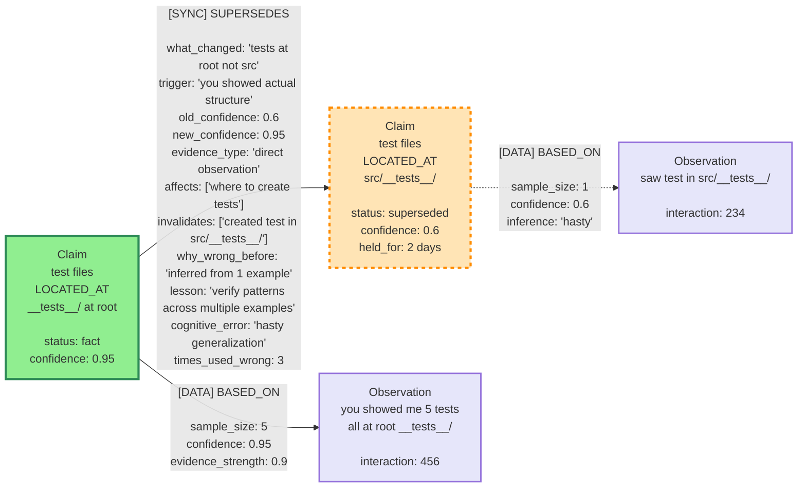
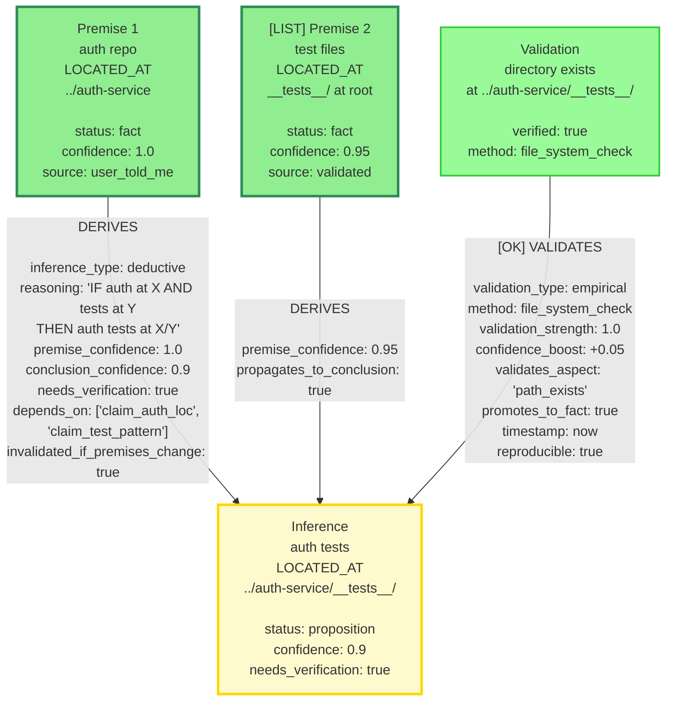
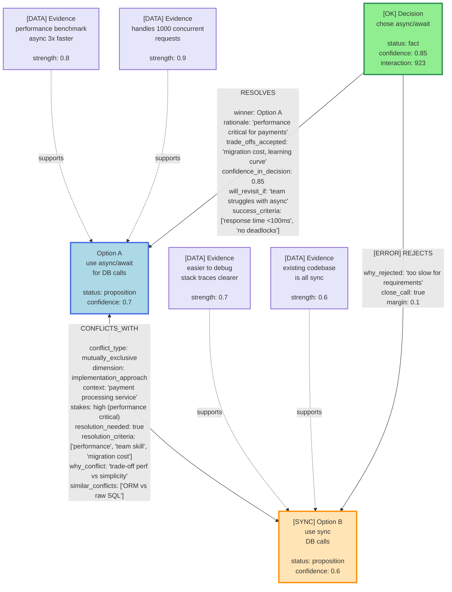
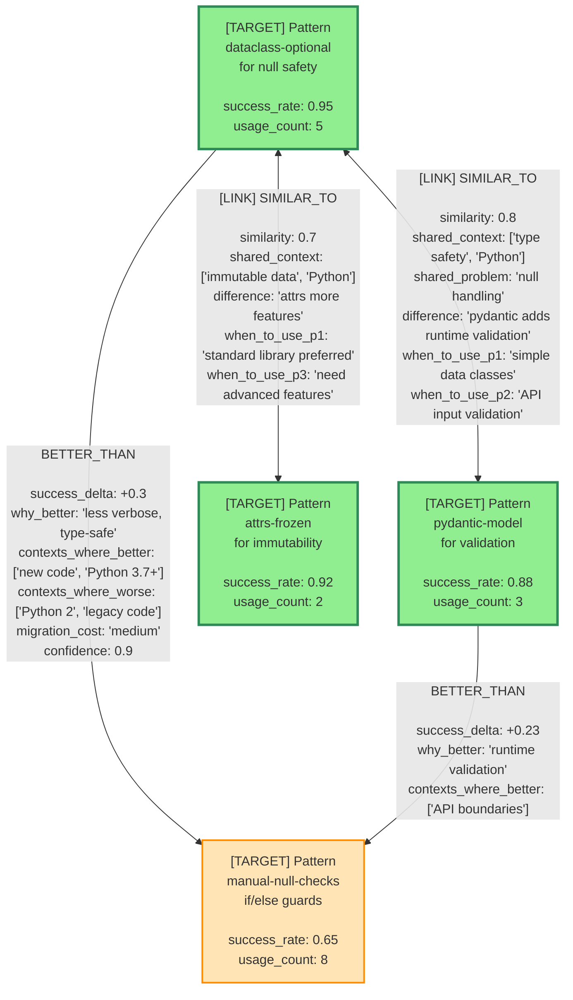
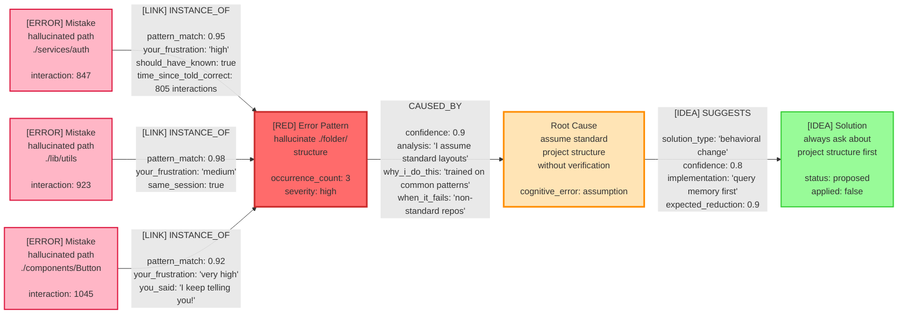

# GML Memory System - Relationship Diagrams

This document visualizes the relationship-first design of the memory system.
The **relationships contain the real knowledge**, not the nodes!

## Scenario 1: The Path Correction Story 

**Key Insight**: The `CORRECTS` relationship captures:
- What I got wrong
- Why I was wrong (hallucinated pattern)
- How many times I've made this mistake (3!)
- Your frustration level
- How long it's been since you told me (805 interactions!)

## Scenario 2: Solution Pattern Evolution [TOOL]

**Key Insight**: The `SOLVED` relationship captures:
- WHY the solution worked (root cause analysis)
- What alternatives we rejected and WHY
- Side benefits we discovered
- Metrics (bugs fixed, tests passing)

The `APPLIED_IN` relationships track pattern reuse and effectiveness!

## Scenario 3: Evolving Understanding 

**Key Insight**: The `SUPERSEDES` relationship captures:
- How my understanding evolved
- What triggered the change
- The lesson learned ("verify patterns across multiple examples")
- The cognitive error I made ("hasty generalization")
- How many times I used the wrong belief (3 times!)

## Scenario 4: Inference Chain [LINK]

**Key Insight**: The `DERIVES` relationship captures:
- The reasoning chain (IF-THEN logic)
- Confidence propagation from premises to conclusion
- Dependencies (what claims this inference depends on)
- Validation needs

The `VALIDATES` relationship captures empirical verification!

## Scenario 5: Conflict Resolution 

**Key Insight**: The `CONFLICTS_WITH` relationship captures:
- The nature of the conflict (mutually exclusive)
- Evidence for BOTH sides
- Resolution criteria
- Trade-offs

The `RESOLVES` relationship captures the decision rationale and what trade-offs we accepted!

## Scenario 6: Pattern Similarity Network 

**Key Insight**: The `SIMILAR_TO` relationship captures:
- Similarity score
- Shared context and problems
- Key differences
- **When to use which pattern** (this is gold!)

The `BETTER_THAN` relationship captures comparative effectiveness!

## Scenario 7: My Recurring Mistakes [SYNC]

**Key Insight**: The `INSTANCE_OF` relationship captures:
- Pattern matching (how similar is this mistake to the pattern)
- Your frustration level (important!)
- Whether I should have known better

The `CAUSED_BY` relationship captures root cause analysis!
The `SUGGESTS` relationship captures proposed solutions!

---

## Summary: The Relationships ARE The Knowledge [IDEA]

Look at what we capture in relationships:

| Relationship | What It Captures |
|-------------|------------------|
| `CORRECTS` | Why I was wrong, pattern of error, how many times, your frustration |
| `SOLVED` | Why it worked, alternatives rejected, side benefits, metrics |
| `SUPERSEDES` | How understanding evolved, lesson learned, cognitive error |
| `DERIVES` | Reasoning chain, confidence propagation, dependencies |
| `CONFLICTS_WITH` | Trade-offs, evidence for each side, resolution criteria |
| `VALIDATES` | Empirical evidence, confidence boost, verification method |
| `SIMILAR_TO` | When to use which pattern, key differences |
| `BETTER_THAN` | Comparative effectiveness, context-dependent |
| `INSTANCE_OF` | Pattern matching, frustration tracking |
| `CAUSED_BY` | Root cause analysis |
| `SUGGESTS` | Proposed solutions, expected effectiveness |

**The nodes are just anchors. The edges contain the wisdom!** 

